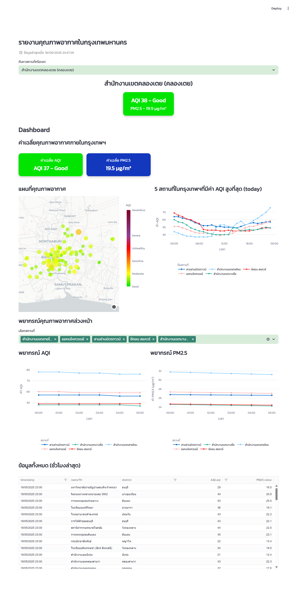

# Bangkok Air Quality Dashboard with Streamlit, Prefect & LakeFS

## PROJECT DSI321: Near Real-Time Data Pipeline with Visualization


&#x20; &#x20;

## 🔎 Overview

This project, developed for the **DSI321: Big Data Infrastructure** course, delivers a near real-time air quality monitoring and forecasting platform for Bangkok. Using data from Air4Thai's API, the system provides hourly updates and six-hour forecasts for PM2.5 and AQI levels.

It features:

* Orchestrated workflows via **Prefect**
* Data versioning with **LakeFS**
* Interactive visualization using **Streamlit**
* Forecasting with **ARIMA** models
* Fully containerized setup via **Docker**

## 🔑 Features

* Live ingestion of AQI & PM2.5 from Bangkok stations
* Forecasting (6h ahead) using ARIMA
* Streamlit dashboard with:

  * Station selector
  * Real-time metrics
  * Heatmap visualization
  * AQI/PM2.5 line charts
* Hourly scheduled flows using Prefect
* Data integrity via LakeFS versioning

## 🛠️ Tools & Technologies

Leverages modern open-source tools:

- **Prefect**: Python-based workflow orchestration and scheduling
- **LakeFS**: Git-like version control system for data lakes
- **Streamlit**: Framework for creating interactive dashboards in Python
- **Docker**: Containerization platform to ensure consistent environments
- **JupyterLab**: Notebook interface for data exploration and testing
- **ARIMA**: Statistical time-series forecasting model for AQI and PM2.5

## ⚙️ Tech Stack

| Component        | Tool/Framework         |
| ---------------- | ---------------------- |
| Orchestration    | Prefect                |
| Visualization    | Streamlit              |
| Forecasting      | ARIMA (statsmodels)    |
| Data Versioning  | LakeFS                 |
| Containerization | Docker, Docker Compose |
| Dev Environment  | JupyterLab             |
| Data Source      | Air4Thai API           |

## 🧬 Data Schema

| Column        | Type     | Description            |
| ------------- | -------- | ---------------------- |
| `timestamp`   | datetime | Measurement time       |
| `stationID`   | string   | Unique station code    |
| `nameTH`      | string   | Station name in Thai   |
| `areaTH`      | string   | Area in Thai           |
| `district`    | string   | Bangkok district name  |
| `lat`, `long` | float    | Geographic coordinates |
| `AQI.aqi`     | int      | AQI value (0–500)      |
| `PM25.value`  | float    | PM2.5 in µg/m³         |

## ✅ Data Quality Checks

* ✔️ 1,000+ records collected
* ✔️ ≥24 hours of data/station
* ✔️ >90% field completeness
* ✔️ No object dtypes
* ✔️ No duplicated rows

Notebook: `check_data_quality.ipynb`

## 🚀 Setup Instructions

### 1. Clone Repository

```bash
git clone https://github.com/khwkong/dsi321_2025.git
cd dsi321_2025
```

### 2. Start Services

```bash
docker-compose up --build -d
```

### 3. Access Local Services

* LakeFS: `http://localhost:8001`
* Jupyter: `http://localhost:8888`
* Prefect: `http://localhost:4200`
* Streamlit: `http://localhost:8502`

LakeFS Login:

* Username: `access_key`
* Password: `secret_key`

Create a LakeFS repo:

```bash
lakectl repo create lakefs://dust-concentration
```

### 4. Upload Data

```bash
docker exec -it dsi321-jupyter-1 bash
python upload.py
```

### 5. Generate Forecasts

```bash
python getdata.py
python forecast.py
```

Or use Prefect UI at `http://localhost:4200`

### 6. Schedule Flows

```bash
python deploy.py       # ingestion every hour @ min 25
python deploy_ml.py    # forecast every hour @ min 27
```

## 📊 Dashboard Preview
<<<<<<< HEAD

=======

>>>>>>> 453d7fe2a837a72ba08878fc807f6a88b29af3b7
### Components

* Real-time readings by station
* Citywide AQI & PM2.5 averages
* AQI heatmap visualization
* Line charts (observed & forecast)
* Interactive table of latest readings

## 🤖 Forecasting

* Forecast horizon: 6 hours ahead
* ARIMA(1,0,1) per station
* Excludes stations with <24h of data or constant values
* Output saved to:

  ```
  lakefs://dust-concentration/main/forecast/forecast.parquet
  ```

## 📁 Repo Structure

```
.
├── data/
│   ├── data.parquet/year=2025/month=5/day=XX/hour=XX/
│   ├── SCHEMA.md
│   └── check_data_quality.ipynb
├── img/
│   └── dashboard_demo.png
├── pipeline/
│   ├── bangkok_districts.geojson
│   ├── getdata.py
│   ├── forecast.py
│   ├── deploy.py
│   ├── deploy_ml.py
│   ├── upload.py
│   └── savedata.py
├── prefect/
│   ├── Dockerfile.jupyter
│   ├── Dockerfile.prefect-worker
│   ├── requirements.txt
│   └── wait-for-server.sh
├── visualization/
│   ├── .streamlit/config.toml
│   └── app.py
├── .gitignore
├── LICENSE
├── README.md
└── docker-compose.yml
```

## 📩 Contact

**Developer**: Panisara Kuiyarat
**Email**: [kui.panisara@gmail.com](mailto:kui.panisara@gmail.com)